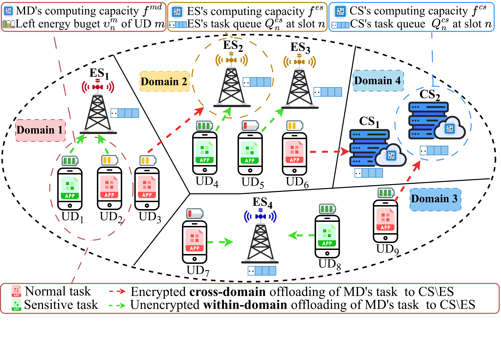
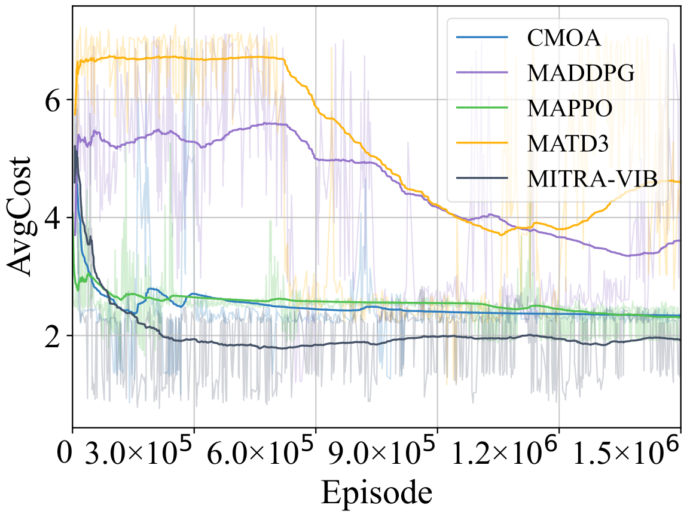
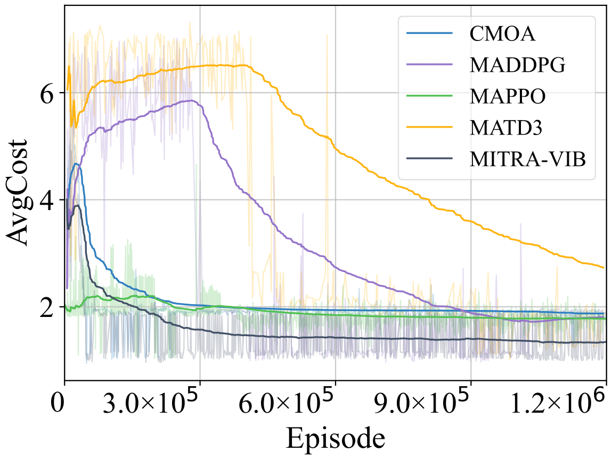
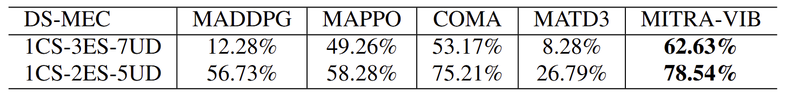
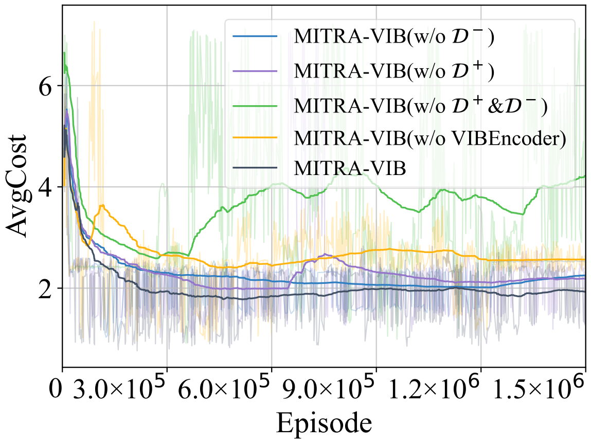
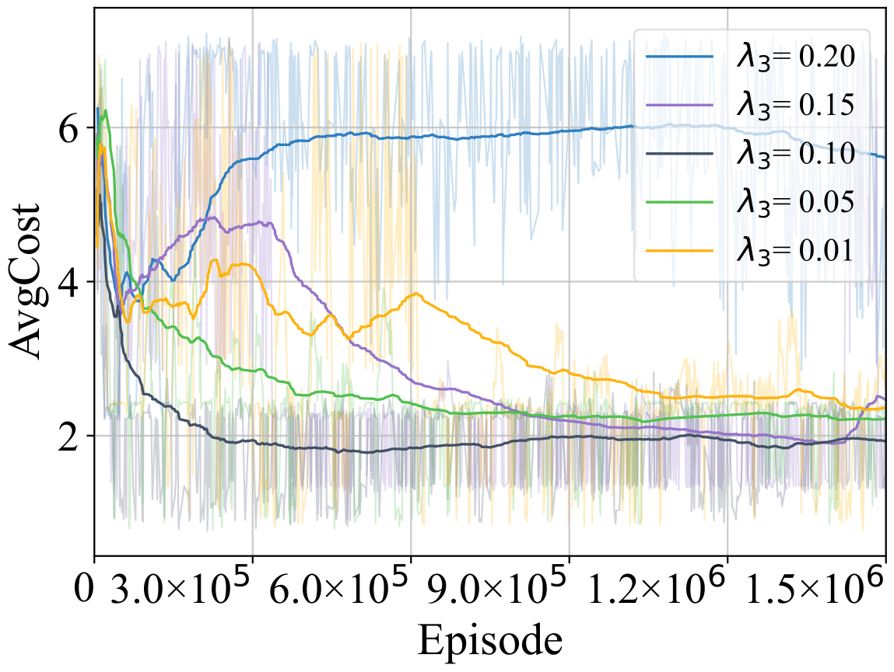

# MITRA-VIB

This repo is the official implementation for the paper: Domain-Secure Cooperative Offloading: VIB-Enhanced Multi-Agent Reinforcement Learning

## Introduction

Mobile Edge Computing (DSMEC) faces significant challenges in task offloading due to security risks from data transmission and the lack of efficient collaboration. To address these issues, we propose MITRA-VIB, a distributed computation offloading framework based on multi-agent reinforcement learning (MARL). Our approach leverages the Variational Information Bottleneck (VIB) to learn task representations and introduces a Credence Mutual Information (CMI) metric as an auxiliary reward to foster effective cooperation. The framework operates under a novel domain-security rule, ensuring privacy via lightweight encryption and within-domain execution constraints.



## Usage

1. Install Pytorch and other necessary dependencies:
   ```
   pip install -r requirements.txt
   ```
2. To train MITRA-VIB:
   ```
   python -u train.py
   ```
3. The baseline code is stored in the `baselines` folder and can be run directly. For example, to train MADDPG:
   ```
   python baselines/offpolicy/scripts/train/train_mpe.py --env_name "DSMEC" --algorithm_name "maddpg" --experiment_name "test" --episode_length 25 --use_soft_update --lr 7e-4 --hard_update_interval_episode 200 --id MADDOG
   ```

## Main Results

<p align="center">
  
  
</p>
<p align="center"><b>Figure1:</b> AvgCost during training in two DS-MEC scenarios.</p>



<p align="center"><b>Table1:</b> Task successrate of all evaluated algorithms in two DS-MEC scenarios.</p>

## Ablation Results
<p align="center">
  
  
</p>
<p align="center"><b>Figure2:</b> Ablation experimental results.</p>

## Concat
If you have any questions or want to use the code, please contact 202422900115@std.uestc.edu.cn